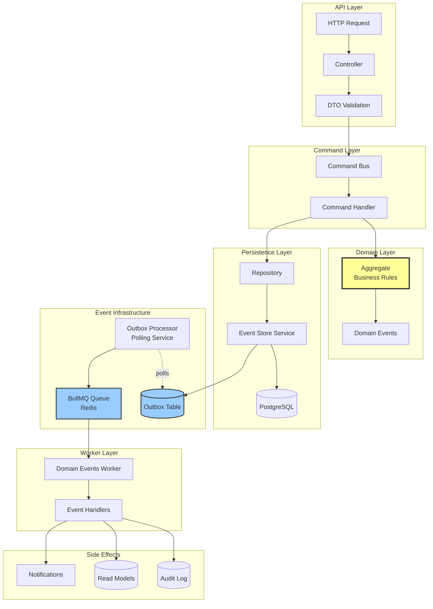

# Veritas Architecture

This document explains the architecture of Veritas, an event-driven backend system built on NestJS.

---

## System Overview

Veritas implements a **modular monolith** with event-driven architecture, CQRS-lite patterns, and an audit-first design. The system prioritizes:

- **Correctness**: Business rules enforced in domain aggregates
- **Auditability**: Complete event history for compliance and debugging
- **Reliability**: Transactional outbox ensures at-least-once event delivery
- **Scalability**: Async processing via workers decouples write and read paths

---

## Architecture Diagram



---

## Complete End-to-End Flow

### Example: Create Action

**1. HTTP Request**
```http
POST /api/actions
Authorization: Bearer <firebase-token>
Content-Type: application/json

{
  "name": "Review Contract",
  "type": "custom",
  "description": "Legal review required"
}
```

**2. API Layer**
- `ActionsController` receives request
- `AuthMiddleware` validates Firebase token, extracts user
- `ValidationPipe` validates DTO against `CreateActionDto`
- Request context created with `correlationId`, `actor`, `timestamp`

**3. Command Layer**
- Controller creates `CreateActionCommand` with payload + metadata
- `CommandBus` routes to `CreateActionHandler`

**4. Domain Layer**
- Handler calls `ActionAggregate.create()`
- Aggregate enforces business rules:
  - Name required and ≤ 200 chars
  - Type must be valid enum
- If valid, aggregate emits `ActionCreatedEvent`
- Event includes full state snapshot + metadata

**5. Persistence (Transactional)**
```typescript
// Single database transaction:
await eventStore.withTransaction(async (tx, persistEvents) => {
  // 1. Insert action state
  await tx.insert(actions).values({...state});
  
  // 2. Persist domain event + outbox entry
  await persistEvents([actionCreatedEvent]);
});
```

This writes to **3 tables atomically**:
- `actions` - Current state
- `domain_events` - Immutable event log
- `event_outbox` - Pending event for publishing

**6. Outbox Processing**
- `OutboxProcessorService` polls every 1 second
- Claims pending events (`SELECT FOR UPDATE SKIP LOCKED`)
- Publishes to BullMQ queue
- Marks outbox entry as `completed`

**7. Worker Processing**
- `DomainEventsWorker` consumes from queue
- Routes event to registered handlers
- `ActionAuditHandler` receives event

**8. Idempotency Check**
```typescript
// Check if already processed
const exists = await checkProcessedEvent(eventId, handlerName);
if (exists) return; // Skip duplicate

// Process event
await createAuditLog(...);

// Mark as processed
await recordProcessedEvent(eventId, handlerName);
```

**9. Audit Log Creation**
- Extract actor, action, snapshots from event
- Insert into `audit_log` table
- Immutable record of what happened

**10. Response**
```json
{
  "actionId": "01932e4f-8b2a-7890-a123-456789abcdef",
  "version": 1
}
```

---

## Failure Scenario: Worker Failure

### Scenario
Worker handler fails while processing `ActionCreatedEvent` due to temporary database connection issue.

### Flow

**1. Event Published to Queue**
- Outbox processor successfully publishes event to BullMQ
- Marks outbox entry as `completed`
- Event now in Redis queue

**2. Worker Picks Up Event**
```typescript
@Processor(DOMAIN_EVENTS_QUEUE)
export class DomainEventsProcessor {
  @Process()
  async process(job: Job) {
    const event = job.data;
    // Route to handlers...
  }
}
```

**3. Handler Execution Fails**
```typescript
async handle(event: IDomainEvent): Promise<void> {
  // Check idempotency
  const processed = await this.checkProcessed(event.eventId);
  if (processed) return; // Already handled
  
  // Attempt to create audit log
  await this.auditService.createAuditLog({...}); // ❌ Throws: Connection timeout
}
```

**4. BullMQ Retry Logic**
```typescript
// Job configuration (from outbox processor)
{
  jobId: eventId,
  attempts: 3,
  backoff: {
    type: 'exponential',
    delay: 1000  // 1s, 2s, 4s
  }
}
```

**Retry Sequence:**
- **Attempt 1**: Fails immediately → Job marked for retry
- **Wait 1 second**
- **Attempt 2**: Fails again → Job marked for retry
- **Wait 2 seconds**
- **Attempt 3**: Succeeds (connection restored) → Job completed

**5. Idempotency Protection**
- Each attempt checks `processed_events` table
- If event was partially processed before crash, skip duplicate work
- Only insert audit log if not already present

**6. Dead Letter Outcome** (if all retries fail)
```typescript
@OnQueueFailed()
async onFailed(job: Job, error: Error) {
  logger.error({
    message: 'Event processing failed after max retries',
    eventId: job.data.eventId,
    eventType: job.data.eventType,
    attempts: job.attemptsMade,
    error: error.message
  });
  
  // Job moves to failed queue
  // Operators can inspect and manually retry
}
```

### Operator Investigation

**1. Check Failed Jobs**
```bash
# Via BullMQ Board or Redis CLI
redis-cli
> LRANGE bull:domain-events:failed 0 -1
```

**2. Query Event Outbox**
```sql
SELECT * FROM event_outbox 
WHERE status = 'failed' 
ORDER BY created_at DESC;
```

**3. Check Processed Events**
```sql
SELECT * FROM processed_events 
WHERE event_id = '<event-id>';
```

**4. Review Audit Logs**
```sql
SELECT * FROM audit_log 
WHERE correlation_id = '<correlation-id>';
```

**5. Manual Retry**
```typescript
// Via admin API or script
await outboxProcessor.triggerProcessing();
// Or reset outbox entry status
await db.update(eventOutbox)
  .set({ status: 'pending', retryCount: 0 })
  .where(eq(eventOutbox.id, outboxId));
```

---

## Why Each Layer Exists

### API Layer
**Purpose**: HTTP interface, authentication, input validation

**Why separate?**
- Decouples transport (HTTP) from business logic
- Enables multiple interfaces (REST, GraphQL, gRPC) without changing domain
- Validation fails fast before touching domain

### Command Layer
**Purpose**: Encapsulate write operations with intent

**Why not direct service calls?**
- Commands are explicit, named intentions (CreateAction, not just "save")
- Enables middleware (logging, authorization, rate limiting)
- Supports command sourcing if needed
- Clear separation between reads (queries) and writes (commands)

### Domain Layer (Aggregates)
**Purpose**: Enforce business rules, maintain invariants

**Why aggregates?**
- Single source of truth for business logic
- Prevents invalid state transitions
- Testable without infrastructure
- Clear transactional boundaries
- Emits events as facts, not side effects

### Event Store + Outbox
**Purpose**: Reliable event persistence and publishing

**Why transactional outbox?**
- Solves dual-write problem (state + event must be atomic)
- Guarantees at-least-once delivery
- Events never lost even if queue is down
- Enables event replay from persistent log

### Worker Layer
**Purpose**: Asynchronous event processing

**Why async?**
- Decouples write path from side effects
- Audit logging doesn't slow down API response
- Retries don't block user requests
- Scales independently (add more workers)

### Audit Log
**Purpose**: Immutable compliance trail

**Why separate from events?**
- Optimized for compliance queries (who did what when)
- Includes contextual data (IP, user agent)
- Before/after snapshots for investigations
- Never deleted (events might be archived)

### Read Models
**Purpose**: Query-optimized views

**Why not query aggregates directly?**
- Aggregates optimized for writes (enforce rules)
- Read models optimized for queries (denormalized, indexed)
- Can rebuild from events if corrupted
- Supports multiple views of same data

---

## Key Design Decisions

### At-Least-Once Delivery
Events may be delivered multiple times if worker crashes mid-processing. Handlers **must be idempotent**.

**Implementation**: `processed_events` table tracks `(eventId, handlerName)` pairs.

### Eventual Consistency
Audit logs and read models are **eventually consistent** with current state. There's a small delay (milliseconds to seconds) between state change and side effects.

**Why acceptable?**
- User gets immediate response (action created)
- Audit log appears shortly after
- Consistency is guaranteed, just not immediate

### No Distributed Transactions
Each aggregate is a transactional boundary. Cross-aggregate consistency via events, not transactions.

**Why?**
- Distributed transactions don't scale
- Events provide loose coupling
- Sagas handle multi-aggregate workflows

### Optimistic Concurrency
Version-based conflict detection prevents lost updates.

**Example:**
```typescript
// User A and B both load Action v1
// User A updates → Action v2 (success)
// User B updates → Conflict! Expected v1, found v2
```

User B must reload and retry.

---

## Monitoring & Observability

### Metrics to Track
- Outbox processing lag (pending events)
- Worker queue depth
- Event processing latency
- Failed job count
- Aggregate version conflicts

### Logging Strategy
- **Structured JSON logs** with correlation IDs
- **Trace requests** end-to-end via correlation ID
- **Error context** includes event payload for debugging

### Health Checks
```typescript
GET /health
{
  "status": "ok",
  "database": "up",
  "redis": "up",
  "outbox": {
    "pending": 12,
    "processing": 3,
    "failed": 0
  }
}
```

---

## Scalability Considerations

### Horizontal Scaling
- **API servers**: Stateless, scale behind load balancer
- **Workers**: Add more instances, BullMQ distributes jobs
- **Outbox processor**: Single instance (uses DB locking) or sharded by aggregate type

### Vertical Scaling
- **Database**: Primary bottleneck, optimize queries and indexes
- **Redis**: In-memory, fast, but monitor memory usage

### Bottlenecks
1. **Database writes** (state + events + outbox)
2. **Outbox polling** (1 second interval)
3. **Worker throughput** (depends on handler complexity)

### Optimization Strategies
- Batch outbox processing (100 events at a time)
- Parallel event handlers (where order doesn't matter)
- Read replicas for queries
- Event archival (move old events to cold storage)

---

## Future Considerations

### When to Extract Services
Current monolith is correct. Consider extraction when:
- **Team boundaries** emerge (separate teams own different aggregates)
- **Deployment independence** needed (deploy Policy changes without Action downtime)
- **Technology divergence** required (Policy needs graph database)
- **Scale mismatch** severe (Policy 1000x more traffic than Action)

**Not before**: Premature distribution adds complexity without benefit.

### Event Versioning
As system evolves, event schemas change. Strategy:
- **Additive changes**: Add optional fields (backward compatible)
- **Breaking changes**: Publish new event version (`ActionCreated_v2`)
- **Upcasting**: Transform old events to new schema on read
- **Deprecation**: Support old versions for grace period

See [consistency.md](file:///c:/Projects/Veritas/docs/consistency.md) for details.

---

## Summary

Veritas architecture is designed for:
- ✅ **Correctness**: Business rules enforced in aggregates
- ✅ **Auditability**: Complete event history
- ✅ **Reliability**: Transactional outbox + retries
- ✅ **Scalability**: Async workers + read models
- ✅ **Debuggability**: Correlation IDs + structured logs
- ✅ **Compliance**: Immutable audit trail

The modular monolith provides clear boundaries without distributed system complexity.
